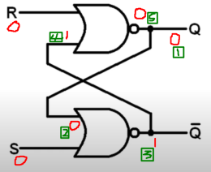

[메인으로 이동](../README.md)

 

# 📒 플립플롭이란 무엇인가?

## 소개

- CPU에 대해 알아보던 중 플립플롭이란 용어가 많이 나와서 플립플롭에 대해 찾아보고 정리한 글이다.

  

# 📖 목차 

- [📖 플립플롭이란?](#flip-flop)
- [📖 래치란?](#latch)
- [📖 클럭 신호란?](#clock-signal)
- [📖 SR 래치란?](#sr-latch)
- [📖 D 플립플롭이란?](#d-flip-flop)
- [📖 참고 자료](#ref)

  

# 📖 플립플롭이란? 

[목차로 이동](#index)

 

## 플립플롭(flip-flop)이란?

- 1비트의 정보를 보관, 유지할 수 있는 회로
- 레지스터를 구성하는 1비트(Bit) 기억장치
- 휘발성으로 전원이 차단되면 저장하던 정보는 사라진다.
- 플립폴롭의 종류
    - RS 플립플롭: 가장 기본적인 플립플롭이지만 R=1, S=1일 때 에러를 발생시킨다.
    - JK 플립플롭: RS플립플롭의 단점을 극복하여 가장 많이 사용되는 플립플롭이다.
        - J = K = 1일 때 출력 값은 기억 값의 보수를 출력한다.
    - T(Toggle) 플립플롭: 입력된 내용의 보수 값을 출력하는 플립플롭이다.
    - D 플립플롭: 입력된 내용을 잠시동안 저장하는 버퍼(Buffer) 역할을 하는 플립플롭이다.

 

## 전자 회로에서 저장은 무슨 의미인가?

- 어떤 신호가 회로에 공급되다 신호가 끊기더라도 그 신호를 계속 유지한다.

 

## 순서논리회로는 무엇인가?

- 외부로부터의 입력과 현재 상태에 따라 출력이 결정되는 회로이다.
- 레지스터, 플립플롭, 카운터 등등이 있다.
- 다음과 같은 구조이다.

  

# 📖 래치란? 

[목차로 이동](#index)

 

## 플립플롭을 설명할 때 많이 언급되는 '래치(latch)'는 무엇인가?

- 플립플롭과 같이 1비트의 신호를 저장하기 위해 사용한다.
- 입력을 지속적으로 확인하고 입력이 변경되면 출력을 변경한다.

 

## 플립플롭과 래치의 차이는?

- 동기화(synchronization)을 위한 클럭(clock)의 유무
- 플립플롭은 클럭이 있어 동기식이며 래치는 클럭이 없어 비동기식이다.

  

# 📖 클럭 신호란? 

[목차로 이동](#index)

 

## 동기적인(synchronous) 회로의 의미는?

- 주기적인 클럭펄스에 따라 출력값이 갱신된다.
- 시간에 동기화되어 여러 입력을 동시에 반영할 수 있다.

 

## 클럭 신호란 무엇인가?

- clock signal
- 논리 상태 H(high, 논리 1)와 L(low, 논리 0)이 주기적으로 나타나는 방형파(square wave)

  

# 📖 SR 래치란? 

[목차로 이동](#index)

 

## SR 래치란?

- 비동기식 장치 (asynchronous device)
- S(set)과 R(reset)라는 2개의 입력과 Q 와 Q'라는 2개의 출력으로 구현
- S가 1이면 Q는 1이 되고 R이 1이면 Q는 0이 된다.
- S와 R 모두 0 이면 Q는 이전 Q 값과 같다.
- S와 R 모두 1인 경우는 정의하지 않는다.
    - 서로 complement 관계에 있는 Q와 Q' 모두 0이되는 모순이 발생한다.

 

## SR 래치의 원리는?

이전 Q 값이 0이고 S와 R이 0인 경우

- 1 : 초기 상태가 0인 상태
- 2 : 초기 상태가 0이므로 이곳도 0
- 3 : NOR을 거쳐서 1
- 4 : 3번이 1이므로 1
- 5 : R이 0이고 4번이 1이므로, NOR을 거쳐서 0

  

# 📖 D 플립플롭이란? 

[목차로 이동](#index)

 

## D 플립플롭의 논리 회로는?

- C가 0일 때는 D가 어떤 값이든 상태가 변화하지 않는다.
- C가 1일 때
    - D가 0이면 Q는 0이 된다.
    - D가 1이면 Q는 1이 된다.

 

  

# 📖 참고 자료 

[목차로 이동](#index)

 

[https://m.blog.naver.com/miniskirtzia/220054685053](https://m.blog.naver.com/miniskirtzia/220054685053)

- SR래치, T 래치, D 플립플롭, JK 래치에 대한 설명

[https://e-funny.tistory.com/13](https://e-funny.tistory.com/13)

- 순서논리회로

[https://m.blog.naver.com/PostView.naver?isHttpsRedirect=true&blogId=deepb1ue&logNo=221238317663](https://m.blog.naver.com/PostView.naver?isHttpsRedirect=true&blogId=deepb1ue&logNo=221238317663)

- 순서논리회로

[https://mattlee.tistory.com/26](https://mattlee.tistory.com/26)

- 래치회로 이해

[https://m.blog.naver.com/woonga98/150029790686](https://m.blog.naver.com/woonga98/150029790686)

- 동기, 비동기

[https://velog.io/@limprove89/%EC%BB%B4%ED%93%A8%ED%84%B0-%EA%B3%B5%ED%95%99%EC%97%90%EC%84%9C%EC%9D%98-%EB%8F%99%EA%B8%B0%ED%99%94](https://velog.io/@limprove89/%EC%BB%B4%ED%93%A8%ED%84%B0-%EA%B3%B5%ED%95%99%EC%97%90%EC%84%9C%EC%9D%98-%EB%8F%99%EA%B8%B0%ED%99%94)

- 동기화의 의미

   

[목차로 이동](#index)

[메인으로 이동](../README.md)