# 윈도우10에서 운영체제 실습 위한 리눅스 환경 구축하기 (WSL2)

## 📖 요약
[인프런 주니온님의 강의](https://www.inflearn.com/course/%EC%9A%B4%EC%98%81%EC%B2%B4%EC%A0%9C-%EA%B3%B5%EB%A3%A1%EC%B1%85-%EC%A0%84%EA%B3%B5%EA%B0%95%EC%9D%98/) 를 참고해서 작성한 글이다.

윈도우10에서 리눅스환경구축부터 c언어 컴파일 및 실행까지 해보는 글이다.

리눅스 실습을 직접 해보면서 운영체제를 공부하고 싶었다. 하지만 또 리눅스를 직접 설치해서 사용하기에는 번거로웠다. 그런 와중에 윈도우10에서 쉽게 실습할 수 있도록 구축하는 방법을 찾았다! 인프런의 주니온님의 '운영체제 공룡책 전공강의' 무료 강의에 나와있다. 이 강의 하나만으로도 정말 엄청나다고 생각한다.


## 📖 구축 과정

### 윈도우 버전 확인하기
- 버전 1903이상, 빌드 18362 이상

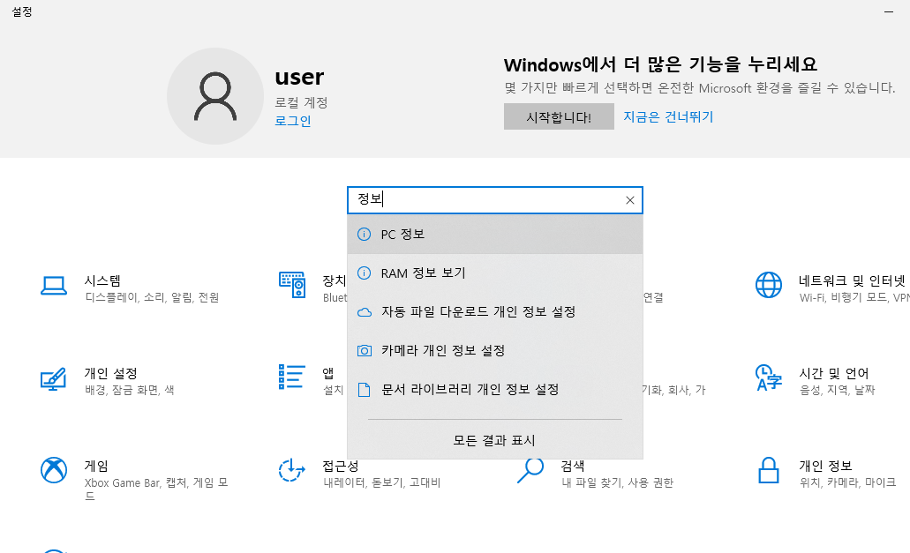


### WSL/가상머신 기능 켜기
설정>Windows 기능 켜기/끄기
Linux용 Windows하위시스템 옵션 체크
가상머신 플랫폼 옵션 체크
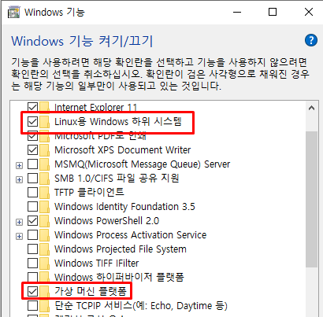

### 리눅스 커널 업데이트

x64 머신용 최신 WSL2 Linux 커널 업데이트 패키지 다운로드
https://wslstorestorage.blob.core.windows.net/wslblob/wsl_update_x64.msi

이걸 설치안하면 그냥 WSL이고 이거까지 설치해야 WSL2이라고 한다.

### Linux 배포판 설치
시작표시줄 검색창 > Microsfot Store > Ubuntu 검색 > Ubuntu 20.04 LTS 버전 다운로드 > 설치

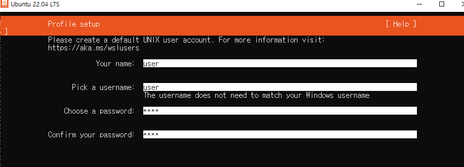

나는 user/user로 했다.


그냥 기본 설정있는 그대로 했다.


### WSL2를 기본버전으로 설정하기
PowerShell 관리자권한으로 실행
다음 명령어 적기
```shell
wsl --set-default-version 2
wsl -l -v
```

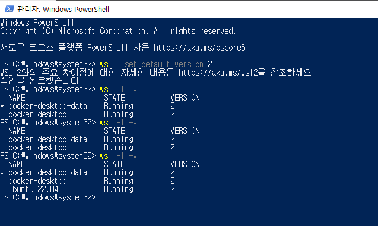

### 우분투에서 GNU 툴체인 설치

- GNU툴체인: gcc/g++/gdb 등의 컴파일러 등의 개발도구들

시작 > Ubuntu 실행

```shell
sudo apt-get update
sudo apt-get install build-essential gdb
gcc --version
g++ --version
gdb --version
```

### Visual Studio Code 설치

### VSC - Remote - WSL 확장팩 설치
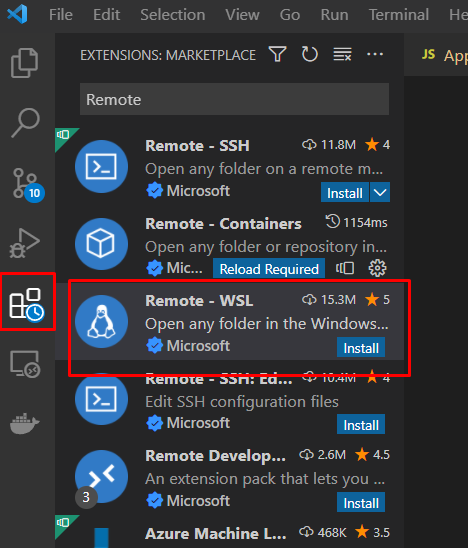

### VSC - WSL 연결하기
- 좌측 하단에 원격창 열기 클릭
- `Remote - WSL: New Window` 클릭
- 폴더 열기 > 홈 디렉토리 열림 > 새 디렉토리 만들고 연결
- WSL closed unexpectedly 에러 발생 시 아래 참고


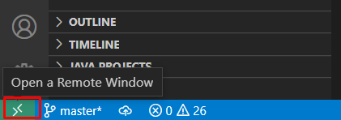


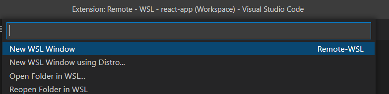

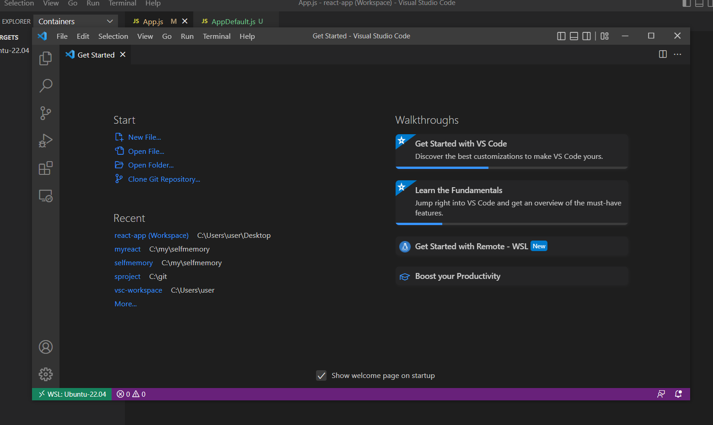

### 폴더 및 c파일 생성 및 실행해보기

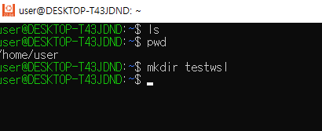

테스트로 우분투에서 testwsl 폴더 생성

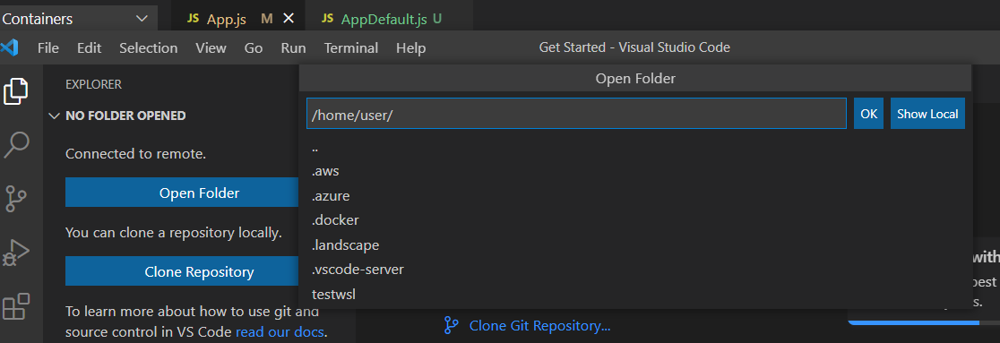

VSC에서 ESC로 방금 열었던 Open Folder 창 닫고 다시 Open Folder 열면 testwsl 생긴 것을 볼 수 있는데 클릭

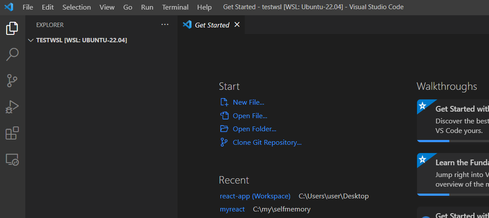

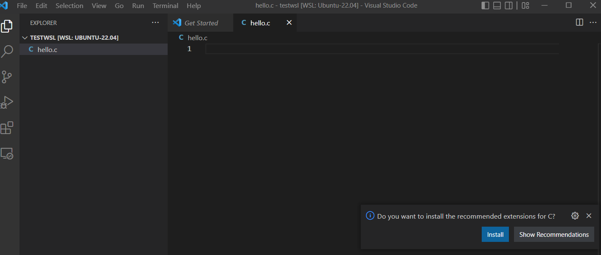

hello.c 파일 생성
생성할 경우 오른쪽 하단에 C extensions 설치할치 묻는데 설치눌러서 설치하기

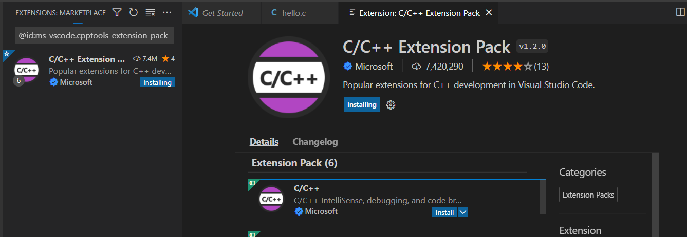


코드 작성하기
hello.c
```c
#include <stdio.h>
#include <unistd.h>
#include <sys/wait.h>

int main() {
    pid_t pid;
    pid = fork();
    printf("Hello, WSL!\n");
    return 0;
}
```

터미널열기


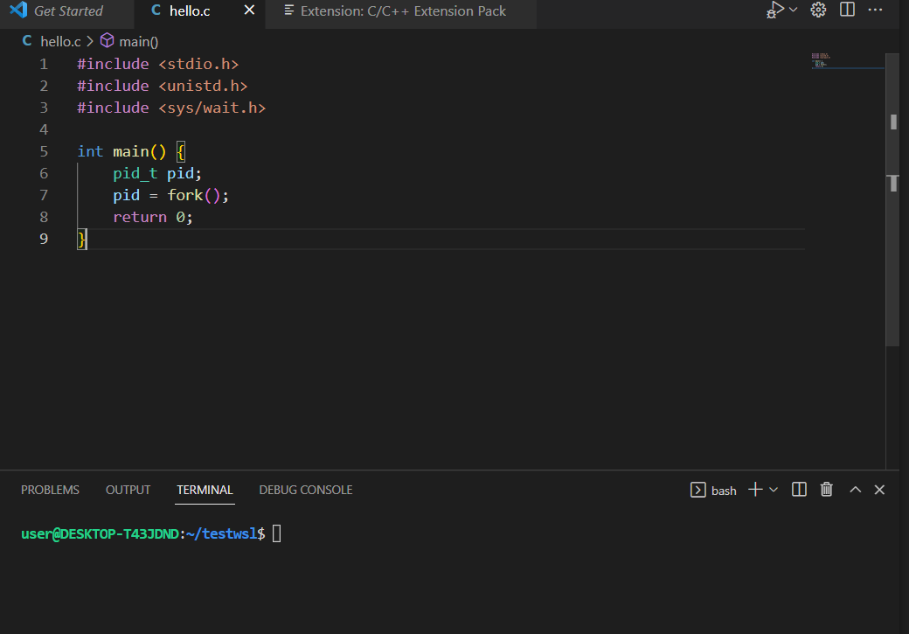

컴파일 후 실행해보기

```shell
ls
gcc hello.c # 컴파일하기
ls
./a.out # 컴파일한 파일 실행하기
```

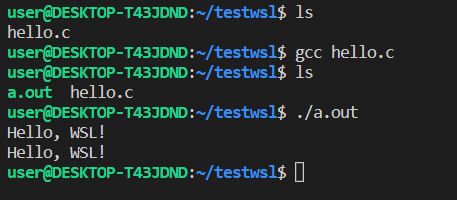

### 윈도우쪽 파일시스템 접근 방법
`cd /mnt/c` 로 윈도우쪽 파일시스템 접근이 가능하다.

### WSL closed unexpectedly 에러 발생 시

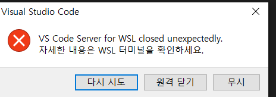

나는 원격창 여는 과정에서 위의 에러가 발생했는데 검색해보니 이미 설치되어 있던 도커 때문에 그랬다.. 


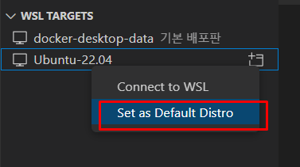

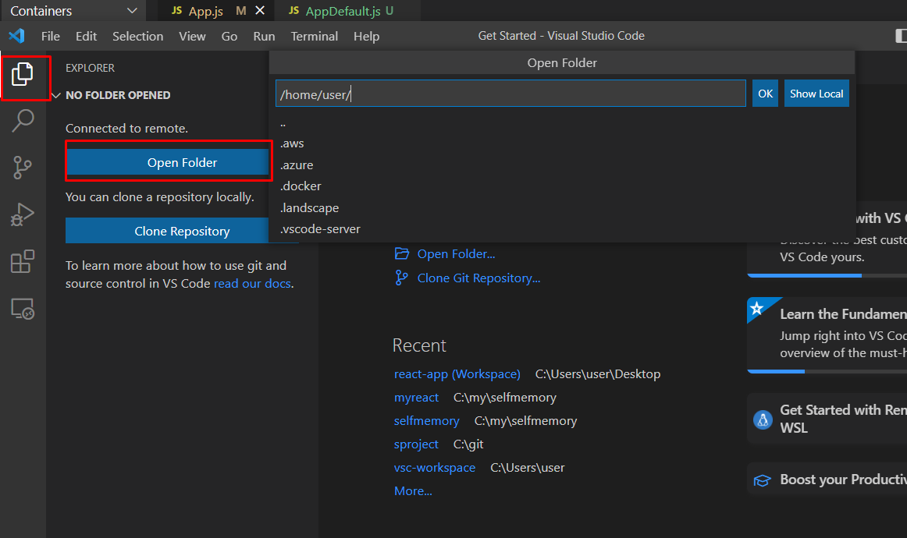
