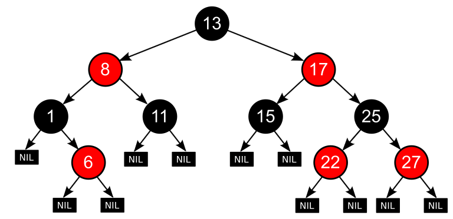

[메인으로 이동](../README.md)

 

# 레드-블랙 트리

 

# 📒 목차 

- [📖 소개](#introduction)
- [📖 알아야 할 선행 지식](#fore)
- [📖 레드-블랙 트리란?](#rbtree)
- [📖 다른 트리와 비교](#differ)
- [📖 추후 공부해야 할 내용](#after)

 

# 📖 소개 

[목차로 이동](#index)

레드-블랙 트리의 원리를 이해하기 위해 공부하고 정리하였다.

 

# 📖 알아야 할 선행 지식 

[목차로 이동](#index)

## 이진 탐색 트리

- 이진 탐색 트리는 모든 노드에 대해 다음 조건을 만족한다.
    - 자신이 가진 자료는 
        - '자신보다 오른쪽에 위치한 부분트리가 가지고 있는 모든 자료'보다 작거나 같고,
        - '자신보다 왼쪽에 위치한 부분트리가 가지고 있는 모든 자료'보다 크거나 같다.

## 트리 관련 용어
- 트리 구조
    - 여러 노드가 한 노드를 가리킬 수 없는 그래프로 최상위 노드가 존재하며 사이클이 존재하지 않는다.
- 루트 노드: 최상위 노드
- 부모 노드와 자식 노드
    - 노드 A가 노드 B를 가리킬 때 A는 부모 노드, B는 자식노드
- 리프 노드: 자식이 없는 노드
- 이진 트리: 각 노드가 최대 두 개의 자식을 갖는 트리

 

# 📖 레드-블랙 트리란? 

[목차로 이동](#index)

## 레드-블랙 트리(Red-black tree)

 

- 자가 균형 이진 탐색 트리
- 트리에 n개의 원소가 있을 때 O(logn)의 시간복잡도로 삽입, 삭제, 검색을 할 수 있다.

### 조건
1. 노드는 레드 또는 블랙 중 하나이다.
1. 루트 노드는 블랙이다.
1. 모드 리프노드들(NIL)은 블랙이다.
1. 레드 노드의 자식노드는 무조건 블랙이다.
1. 임의의 노드에 대한 각각의 하위 리프 노드까지의 경로마다 같은 개수의 블랙 노드(리프 노드 제외)가 있다. 

### 성질
- 레드 노드가 연달아 나타날 수 없게 된다. (4에 의해)
- 레드 노드의 부모는 반드시 블랙 노드가 될 수 밖에 없게 된다. (4에 의해)
- <b>(중요 성질)</b> `루트 노드부터 가장 먼 리프 노드까지의 거리 < 2 * 가장 가까운 리프 노드 까지의 경로` 를 항상 만족한다.

 

## 레드-블랙 트리가 활용되는 곳

- 자바(JAVA)의 TreeSet과 TreeMap

 

# 📖 다른 트리와 비교 

[목차로 이동](#index)

## 이진 트리와 비교했을 때
- 기존의 이진 트리의 경우 균형이 망가져 한쪽으로만 값이 쏠릴 경우 검색 효율이 떨어지게 된다.
- 좌우 균형 잡힌 트리로 안정적인 검색 효율을 보여준다.

## AVL 트리와의 차이점

- AVL 트리는 레드-블랙 트리보다 균형이 잡혀 있지만, 삽입 및 삭제 에서 더 많은 회전이 발생할 수 있다고 한다.
    - 삽입 및 삭제: 레드-블랙 트리 유리
    - 검색: AVL 트리 유리

 

# 📖 추후 공부해야 할 내용 

- 레드-블랙 트리 알고리즘 구현
- AVL 트리에 대한 기본적인 내용

   

[목차로 이동](#index)

[메인으로 이동](../README.md)