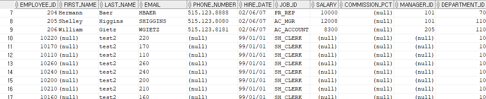

# 📒 MERGE문 써보면서 이해해보기
merge문 예전에 학원 프로젝트할 때도 썼었던 거 같은데.. 다시보니까 뭔가 헷갈리는 부분이 있는 거 같아 직접 써보기로 했다!!

직접 써보면서 테스트해보니 왜 MERGE문 헷갈렸는지 알겠다.. 정확하게 이해하지 못하고 있었다.


## 📖 MERGE 정리

아래처럼 직접 써보고 내린 정리

```sql
MERGE INTO tb1 a
USING tb2 b
ON (a.col1 = b.col2)
WHEN MATCHED THEN
UPDATE ~
WHEN NOT MATCHED THEN
INSERT ~
```

USING 뒤에 부분 b 테이블의 row를 하나씩 꺼내서
ON 안에 b의 컬럼 부분에 넣는다.
그리고 해당 조건으로 a 테이블을 조회한다.
이 때 존재하면 UPDATE하고 존재하지 않으면 INSERT한다.

즉, USING에 사용한 테이블 또는 뷰의 개수만큼 실행한다.

UPDATE나 INSERT 값에는 b.~ 와 같이 넣어서 b 테이블에서 꺼낸 row에 대한 컬럼 값을 사용할 수 있다. 


## 📖 DUAL 예제

### empoyyes 테이블

`SELECT * FROM empployees;`


### INSERT

```sql
MERGE INTO employees a
USING dual b
ON (a.employee_id = '1000')
WHEN MATCHED THEN
UPDATE SET a.salary = 2601
WHEN NOT MATCHED THEN
INSERT (a.employee_id, a.last_name, a.email, a.hire_date, a.job_id)
VALUES('1000', 'test', 'test', TO_DATE('1999-01-01','YYYY-MM-DD'), 'SH_CLERK');
```


### UPDATE

```sql
MERGE INTO employees a
USING dual b
ON (a.employee_id = '1000')
WHEN MATCHED THEN
UPDATE SET a.salary = 2601
WHEN NOT MATCHED THEN
INSERT (a.employee_id, a.last_name, a.email, a.hire_date, a.job_id)
VALUES('1000', 'test', 'test', TO_DATE('1999-01-01','YYYY-MM-DD'), 'SH_CLERK');
```


위 쿼리를 한번 더 실행하면 a.employee_id가 1000인 값이 존재하므로 UPDATE 실행

## 📖 테이블 예제1 - USING에 테이블 사용

`SELECT * FROM employees;`


<br>

`SELECT * FROM departments;`


<br>

`SELECT COUNT(*) FROM departments;`


### INSERT
```sql
MERGE INTO employees a
USING (SELECT department_id FROM departments) b
ON (a.department_id = b.department_id AND a.employee_id = '10100')
WHEN MATCHED THEN
UPDATE SET a.first_name = 'update'
WHEN NOT MATCHED THEN
INSERT (a.employee_id, a.last_name, a.email, a.hire_date, a.job_id, a.department_id)
VALUES(b.department_id+10000, 'test2', b.department_id, TO_DATE('1999-01-01','YYYY-MM-DD'), 'SH_CLERK', 10);
```


### UPDATE

```sql
MERGE INTO employees a
USING (SELECT department_id FROM departments) b
ON (a.department_id = b.department_id AND a.employee_id = '10100')
WHEN MATCHED THEN
UPDATE SET a.first_name = 'update'
WHEN NOT MATCHED THEN
INSERT (a.employee_id, a.last_name, a.email, a.hire_date, a.job_id, a.department_id)
VALUES(b.department_id+100000, 'test2', b.department_id + 100000, TO_DATE('1999-01-01','YYYY-MM-DD'), 'SH_CLERK', 10);

```


`employee_id`가 10100인 경우에만 update

나머지의 경우에는 insert


## 📖 테이블 예제2 - USING에 WHERE 조건 추가

앞의 예제의 쿼리들은 모두 롤백 후 초기 상태에서 실행

### USING 사용 테이블

`SELECT COUNT(*) FROM departments WHERE department_id >= 100;`


### INSERT

```sql
MERGE INTO employees a
USING (SELECT department_id FROM departments WHERE department_id >= 100) b
ON (a.department_id = b.department_id AND a.employee_id = '10100')
WHEN MATCHED THEN
UPDATE SET a.first_name = 'update'
WHEN NOT MATCHED THEN
INSERT (a.employee_id, a.last_name, a.email, a.hire_date, a.job_id, a.department_id)
VALUES(b.department_id+10000, 'test2', b.department_id, TO_DATE('1999-01-01','YYYY-MM-DD'), 'SH_CLERK', 10);
```





### UPDATE

```sql
MERGE INTO employees a
USING (SELECT department_id FROM departments WHERE department_id >= 100) b
ON (a.department_id = b.department_id AND a.employee_id = '10100')
WHEN MATCHED THEN
UPDATE SET a.first_name = 'update'
WHEN NOT MATCHED THEN
INSERT (a.employee_id, a.last_name, a.email, a.hire_date, a.job_id, a.department_id)
VALUES(b.department_id+100000, 'test2', b.department_id+10000, TO_DATE('1999-01-01','YYYY-MM-DD'), 'SH_CLERK', 10);
```


USING에 department_id >= 100 조건이 있으므로, a.employee_id가 10100인 row가 존재하더라도 해당 row의 department_id는 10이므로 조건을 만족하지 못하게 된다. 따라서 18개 행 모두 새로 추가된다.

만약 INSERT할 때 a.department_id를 100이상으로 했다면 a.eployee_id가 10100인 row가 update될 것이다. 다음과 같이 말이다.

### INSERT문에서 a.department_id 값을 100으로 하고 위 시행을 반복했을 때

```sql
MERGE INTO employees a
USING (SELECT department_id FROM departments WHERE department_id >= 100) b
ON (a.department_id = b.department_id AND a.employee_id = '10100')
WHEN MATCHED THEN
UPDATE SET a.first_name = 'update'
WHEN NOT MATCHED THEN
INSERT (a.employee_id, a.last_name, a.email, a.hire_date, a.job_id, a.department_id)
VALUES(b.department_id + 100000, 'test2', b.department_id + 10000, TO_DATE('1999-01-01','YYYY-MM-DD'), 'SH_CLERK', 100);

```

