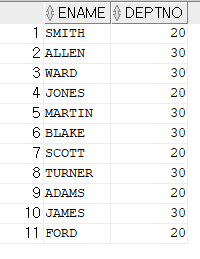

[메인으로 이동](../README.md)

<br>

# 📒 UNION 쿼리와 UNION ALL 쿼리 알아보기

## ♟ 소개

- UNION 쿼리와 UNION ALL 쿼리가 무엇인지 직접 사용해보고 정리한 글이다.

<br><br>


# 📖 목차 <a id="index">

1. [📖 정리](#1)
1. [📖 실습](#2)

<br><br>

# 📖 정리 <a id="1">

[목차로 이동](#index)

## ♟ UNION 쿼리와 UNION ALL 쿼리란?

### UNION 쿼리

- 여러 셀렉트의 결과들을 같이 보여준다.
- 각각 셀렉트의 결과 중 중복되는 레코드는 중복제거를 하고 보여준다.

### UNION ALL 쿼리

- UNION 쿼리와 비슷하지만 중복되는 레코드가 있더라도 그대로 모두 보여준다.

<br><br>

# 📖 실습 <a id="2">

[목차로 이동](#index)

## ♟ UNION 쿼리와 UNION ALL 쿼리 실습

### 쿼리 A (deptno = 20)

```sql
SELECT ename, deptno FROM EMP WHERE deptno = 20;
```


### 쿼리 B (deptno = 30)

```sql
SELECT ename, deptno FROM EMP WHERE deptno = 30;
```


### 쿼리 C (deptno = 20 or deptno = 30)

```sql
SELECT ename, deptno FROM EMP WHERE deptno = 20 OR deptno = 30;
```



### A쿼리 UNION B쿼리

```sql
SELECT ename, deptno FROM EMP WHERE deptno = 20
UNION
SELECT ename, deptno FROM EMP WHERE deptno = 30;
```


### A쿼리 UNION ALL B쿼리

```sql
SELECT ename, deptno FROM EMP WHERE deptno = 20
UNION ALL
SELECT ename, deptno FROM EMP WHERE deptno = 30;
```


### A쿼리 UNION C쿼리

```sql
SELECT ename, deptno FROM EMP WHERE deptno = 20
UNION
SELECT ename, deptno FROM EMP WHERE deptno = 20 OR deptno = 30;
```


### A쿼리 UNION ALL C쿼리

```sql
SELECT ename, deptno FROM EMP WHERE deptno = 20
UNION ALL
SELECT ename, deptno FROM EMP WHERE deptno = 20 OR deptno = 30;
```


<br><br><br>

[목차로 이동](#index)

[메인으로 이동](../README.md)