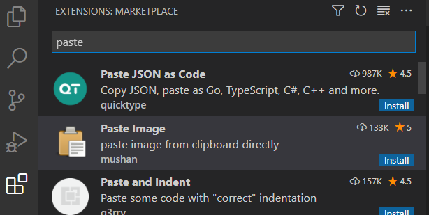
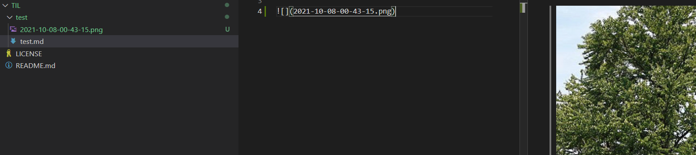
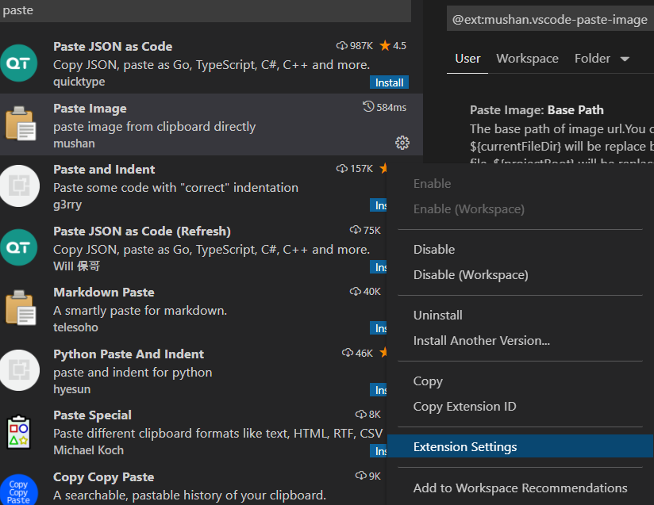
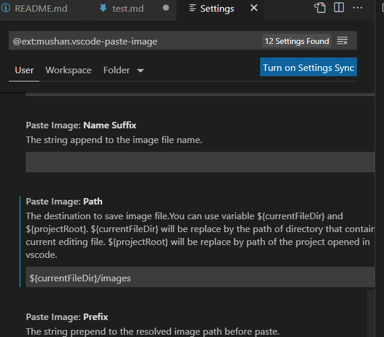
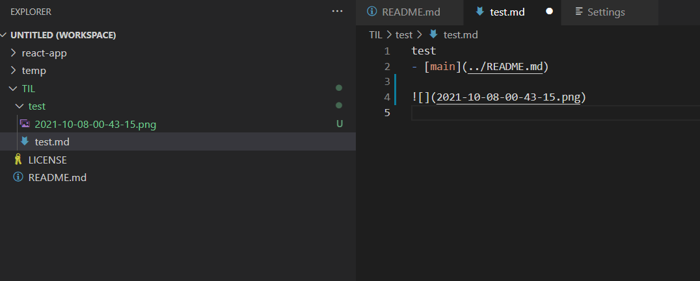
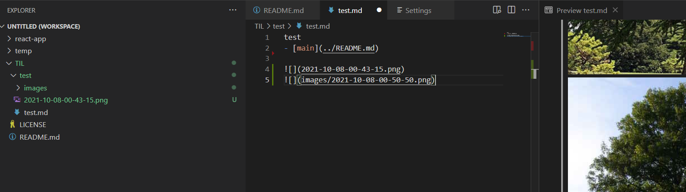

[메인으로 이동](../README.md)

 

# vsc에서 마크다운 이미지 첨부 쉽게하기

 

# 📒 목차 

- [📖 소개](#introduction)
- [📖 사용 방법](#how-to-do)
- [📖 이미지 저장 경로 설정하기](#setting-image-path)

  

# 📖 소개 

[목차로 이동](#index)

 

vsc(Visual Studio Code)에서 마크다운 문서를 작성할 때 이미지 첨부를 쉽게 하는 방법에 대해 정리한 글이다.  

단축키 하나로 이미지 파일 생성에서 첨부까지 쉽게 할 수 있다.

  

# 📖 사용 방법  

[목차로 이동](#index)

 

### ✅ vsc에서 Paste Image 설치하기

 

  

 

### ✅ 이미지 복사 후 `ctrl + alt + v` 로 이미지 붙여넣기

 

 

마크다운 파일 경로에 png 이미지 파일을 자동으로 생성한 후에 붙여넣기를 실행한다.

  

# 📖 이미지 저장 경로 설정하기 

[목차로 이동](#index)

 

### ✅ Paste Image - Extension Settings

 

  

 

### ✅ Settings - Paste Image: Path 에서 원하는 경로로 설정하기

 

붙여넣으려는 md 파일 경로에 images 폴더 내에 저장하고싶다면 `${currentFileDir}/images`로 저장한다.

 

  

 

### ✅ `ctrl + alt + v` 로 붙여넣기 실행해보기

`ctrl + alt + v` 입력 시 images 폴더 안에 이미지가 생성되고 붙여넣어진 것을 확인할 수 있다.

 

 

 

[목차로 이동](#index)

[메인으로 이동](../README.md)