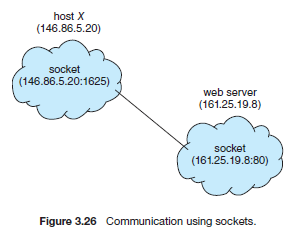

[메인으로 이동](../README.md)

 

# 프로세스 간 통신

# 📒 목차 
- [📖 IPC의 2가지 모델](#ipc-model)
- [📖 소켓](#socket)
- [📖 참고자료](#ref)

 

# 📖 IPC의 2가지 모델 

[목차로 이동](#index)

## Interprocess communication의 2가지 기본 모델
- shared memory
- message passing

## shared-memory model
- 공유 메모리 구역이 존재한다.
- 프로세스는 공유 메모리 구역을 읽고 쓰면서 정보를 교환한다.

## message-passing model
- 프로세스 간 교환되는 메시지를 통해 통신한다.

## 두 모델 간의 비교
- message-passing는 충돌 회피를 고려할 필요가 없다.
- shared-memory가 더 빠르다.
    - message-passing은 시스템 콜이 사용되기 때문에 커널의 개입으로 더 많은 시간이 소요된다.
    - shared-memory에서 시스템 콜은 공유 메모리 구역을 만들 때만 요구된다.

 

# 📖 소켓 

[목차로 이동](#index)

## 소켓
- 통신을 위한 엔드포인트로 정의된다.
- 소켓은 IP주소와 포트넘버로 식별된다.
- 일반적으로 클라이언트-서버 시스템에서 통신하는 데 사용한다.

## 소켓 연결 예시

1. IP가 146.86.5.20인 호스트 x의 클라이언트가 웹서버(포트 90에서 연결 대기중인(listening))에 연결을 맺길 원한다.
    
1. 호스트 X는 포트 1625를 배정 받는다

1. 연결은 한 쌍의 소켓으로 이루어진다.
    - 호스트 X에서 146.86.5.20:1625
    - 웹서버에서 161.25.19.8:80

- 모든 연결은 유일해야한다. 호스트 X의 다른 프로세스가 같은 웹서버와 연결을 원할 때에는 1625 외 다른 포트를 이용해야 한다.

## 자바에서의 소켓
- 자바는 세가지 유형의 소켓을 제공한다.
- Connection-oriented(TCP) 소켓은 `Socket` 클래스에서 제공한다.
- Connectionless(UDP) 소켓은 `DatagramSocket` 클래스에서 제공한다.
- 다중 수신자에게 데이터를 보내기 위한 multicast 소켓은 `MulticastSocket` 클래스에서 제공한다.

 

# 📖 참고 자료 

[목차로 이동](#index)

Operating System Concepts 10th edition - Wiley (2018)

   

[목차로 이동](#index)

[메인으로 이동](../README.md)